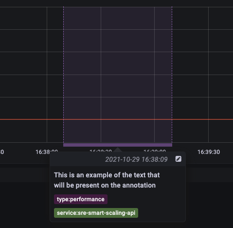

# grafana-annotation-action <a href="https://github.com/danieloneilldazn/grafana-annotation-action/actions"></a> [](https://github.com/danieloneilldazn/grafana-annotation-action/releases)

GitHub Action for Grafana annotations.



## Creating an annotation and updating the end time after some actions.

```yaml
jobs:
  example:
    name: example job
    runs-on: ubuntu-latest
    steps:
      - name: Add Grafana annotation
        id: grafana
        uses: danieloneilldazn/grafana-annotation-action@v0
        with:
          grafanaHost: "https://grafana.example.com"
          grafanaToken: ${{ secrets.GRAFANA_TOKEN }}
          grafanaText: |
            This is an example of the text that
            will be present on the annotation
          grafanaTags: |
            type:performance
            service:sre-smart-scaling-api
      - name: Action that takes some time
        run: sleep 30
      - name: Update Grafana annotation
        uses: danieloneilldazn/grafana-annotation-action@v0
        with:
          grafanaHost: "https://grafana.example.com"
          grafanaToken: ${{ secrets.GRAFANA_TOKEN }}
          grafanaAnnotationID: ${{ steps.grafana.outputs.annotation-id }} # Output from previous usage of action
```

### Parameters

* `grafanaHost` **Required**: The Grafana API host.
* `grafanaToken` **Required**: The Grafana API authentication token.
* `grafanaText` **Required**: The Grafana Annotation text.
* `grafanaDashboardID` **Optional**: Used to target a specific dashboard panel alongside `grafanaPanelID`.
* `grafanaPanelID` **Optional**: Used to target a specific panel alongside `grafanaDashboardID`.
* `grafanaTags` **Optional**: Newline separated tags that will be sent with annotation.
* `grafanaAnnotationID` **Optional**: If supplied, an exiting annotation will be updated with the end-time as current time.
